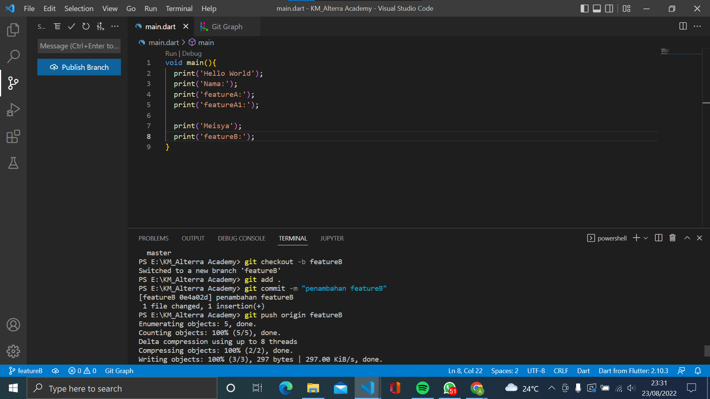
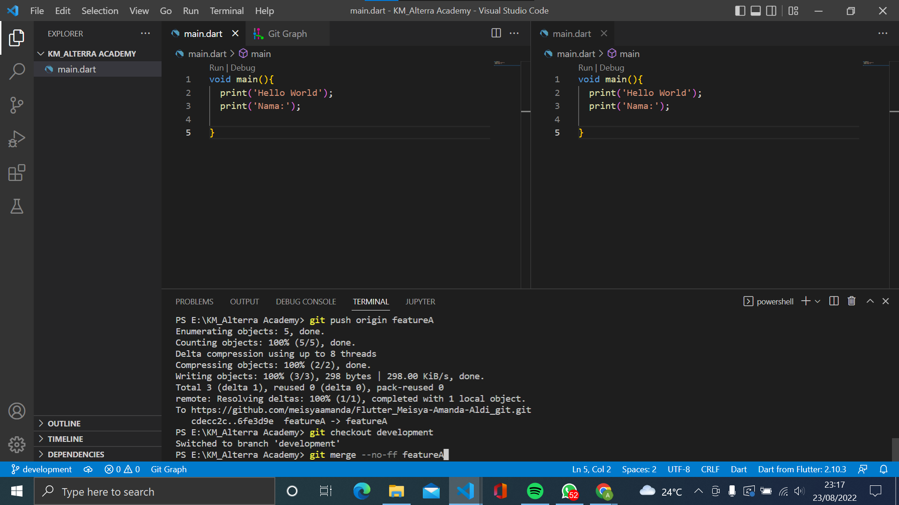
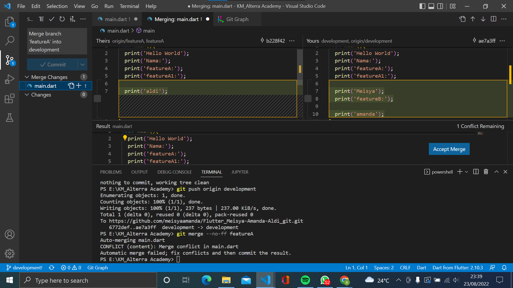

# (03) Basic Version and Branch Management (GIT)

## Data Diri
Nomor Urut: 1_018FLB_40

Nama : Meisya Amanda Aldi

## Summary / Resume
Pada section ini saya belajar tentang: Basic Version and Branch Management (GIT). 
- Membuat repository baru pada GitHub.
- Branch merupakan sebuah cord didalam project. 
- Pembuatan branching lainnya agar perubahan tidak mengganggu file master dengan menggunakan perintah - perintah git.
- Git push digunakan untuk mempush file yang ada di repo local ke repo GitHub.
- Merge merupakan penggabungan 2 branch selain branch master.
- Stash merupakan penyimpanan sementara. maksudnya jika kita salah branch kita bisa pindahkan sementara file tersebut dan kita pindahkan ke branch yang benar.
- Git pull akan mengambil commit terbaru dan otomatis me merge dengan branch yang aktif

## Task

### Task 01
Saya membuat sebuah repository di GitHub dengan nama Flutter_Meisya-Amanda-Aldi.
Berikut tampilan halaman pembuatan repository 

### Task 02
Implementasikan penggunaan branching yang terdiri dari master, development, featureA dan featureB.
1. Untuk membuat sebuah branch hal yang harus dilakukan pertama - tama yaitu inisialisasikan ke GitHub dengan perintah git init

2. git remote digunakan untuk menghubungkan git dengan GitHub dengan memasukkan link GitHub.

3. selanjutnya kita menambah file dengan perintah git add. fungsi . disini unuk menambah seluruh file yang ada dalam sebuah folder. ketika kita menambahkan file maka semua file pindah ke staging area.
4. jika sudah menambahkan file kita commit file tersebut. commit ini berguna untuk memindahkan file yang sedang berada di staging area ke repository local. setelah di commit kita push file yang berada di repo local ke akun GitHub. jika sudah kita push otomatis akan terbuat branch master.

5. untuk membuat branch development yaitu dengan menggunakan perintah **git checkout -b development**. ketika perintah itu dijalankan mata branch tersebut membuat branch development dan langsung berpindah dari branch master ke development. begitu juga untuk membuat branch featureA dan featureB.
jangan lupa disetiap branch terdapat pembaharuan isi file.

### Task 03
Implementasi push, pull, stash, merge
- setiap kita ingin menambahkan file atau mengubah file kita harus melakukan **push** untuk pembaharuan kedalam branch di GitHub. maka dari itu kita menggunakan perintah **git push origin namabranch** 
- git stash digunakan sebagai penyimpanan sementara.
- git merge digunakan untuk menggabungkan 2 branch. untuk contoh kita akan menggabungkan branch development dengan branch featureA

-git pull digunakan untuk 

### Task 04
Penanganan conflict 
penangan konflik pada branch dev yaitu pilih data yang ingin di merge lalu klik accept seperti gambar dibawah. 

### Task 05
menggunakan merge no fast forward 

- network graph
