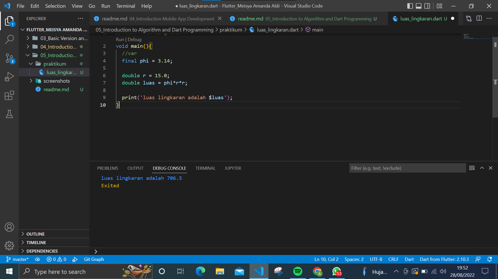
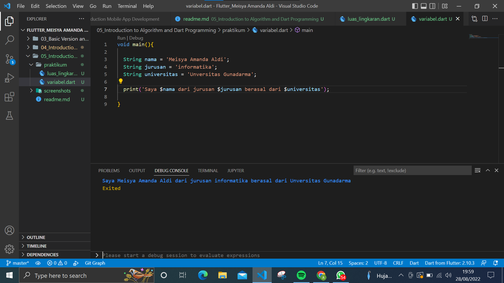

# (05) Introduction to Algorithm and Dart Programming
## Data Diri
Nomor Urut: 1_018FLB_40

Nama : Meisya Amanda Aldi

## Summary / Resumue
Pada section ini saya belajar tentang introduction to algorithm and dart programming. introduction to algorithm and dart program membahas bahasa pemograman dart.
- Bahasa pemograman dart merupakan bahasa pemograman yang dikembangkan oleh google dan sekitar 2011 di publikasikan. Bahasa ini pengembangan dari bahasa c. bahasa pemograman dart bersifat open source jadi siapa saja bisa menggunakan bahasa ini. 
- Pada dart terdapat fungsi main. fungsi main ini bagian pertama yang dijalankan. type yang digunakan pada main adalah void yang mana tidak mengembalikan nilai. 
- Variabel dart.
variabel dapat mengubah nilai. contoh : int usia;
- Konstanta 
konstanta merupakan nilai yang tidak dapat dirubah. keyword pada konstanta adalah final. contoh final phi = 3.14;
- Tipe data
terdiri dari int, double, boll, string.
- Operator 
terdiri dari arithmetic, assignment, comparison, logical.

## Task
### Task 01
Implementasi rumus luas lingkaran pada program dart!
Jawab:
Sesuai penjelasan di atas bahwa saat memulai menggunakan dart menggunakan fungsi main. lalu deklarasikan phi dengan menggunakan konstanta dengan keyword final agar nilai phi tetap. 
untuk variabel r dengan menggunakan tipe data double. untuk variabel luas dengan tipe data double yang berisi rumus lingkaran. dan untuk menampilkan hasil luas ke layar menggunakan perintah print(). berikut implementasi rumus luas lingkaran menggunakan bahasa pemograman dart.

### Task 02
Buatlah 3 buah variabel yang berisi string, lalu sambungkan seluruh string tersebut, dan tampilkan pada layar!
Jawab:
Tipe data string merupakan tipe data yang berisi huruf maupun angka. pada contoh dibawah ini saya menggunakan variabel nama, jurusan dan universitas menggunakan string. untuk menampilkan ke layar menggunakan print. Agar hasilnya dapat digabung menggunakan interpolasi string ($) dan diikuti nama variabel.
