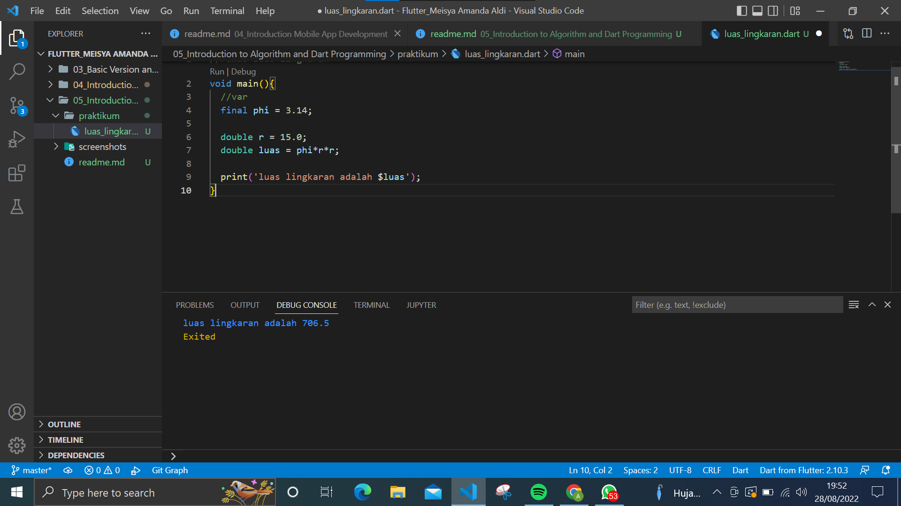
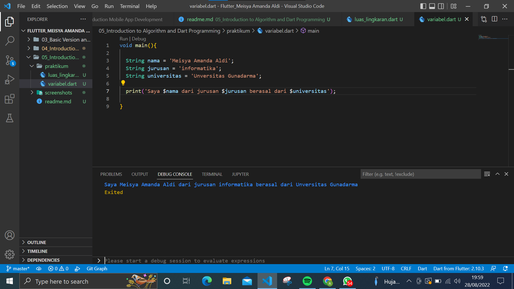

# (05) Basic Dart Programming
## Data Diri
Nomor Urut: 1_018FLB_40

Nama : Meisya Amanda Aldi

## Summary / Resumue
Pada section ini saya belajar tentang Basic Dart programming. 
1. fungsi lanjutan terdiri dari
- Anonymous Function 
- arrow function 

2. Async - await
menjalankan beberapa proses tanpa harus menunggu.  proses ditulis dalam bentuk fungsi.

3. Collection merupakan kumpilan data. collection terdiri dari:
- list : menyimpan data secara baris dan memiliki index dengan index dimulai dengan angka 0. bisa menggunakan perulangan for in untuk mengambil data secara otomatis.
- Map : menyimpan data secara key -value. 

## Task

### Task 01
Implementasi rumus luas lingkaran pada program dart!
Jawab:
Sesuai penjelasan di atas bahwa saat memulai menggunakan dart menggunakan fungsi main. lalu deklarasikan phi dengan menggunakan konstanta dengan keyword final agar nilai phi tetap. 
untuk variabel r dengan menggunakan tipe data double. untuk variabel luas dengan tipe data double yang berisi rumus lingkaran. dan untuk menampilkan hasil luas ke layar menggunakan perintah print(). berikut implementasi rumus luas lingkaran menggunakan bahasa pemograman dart.

### Task 02
Buatlah 3 buah variabel yang berisi string, lalu sambungkan seluruh string tersebut, dan tampilkan pada layar!
Jawab:
Tipe data string merupakan tipe data yang berisi huruf maupun angka. pada contoh dibawah ini saya menggunakan variabel nama, jurusan dan universitas menggunakan string. untuk menampilkan ke layar menggunakan print. Agar hasilnya dapat digabung menggunakan interpolasi string ($) dan diikuti nama variabel.
